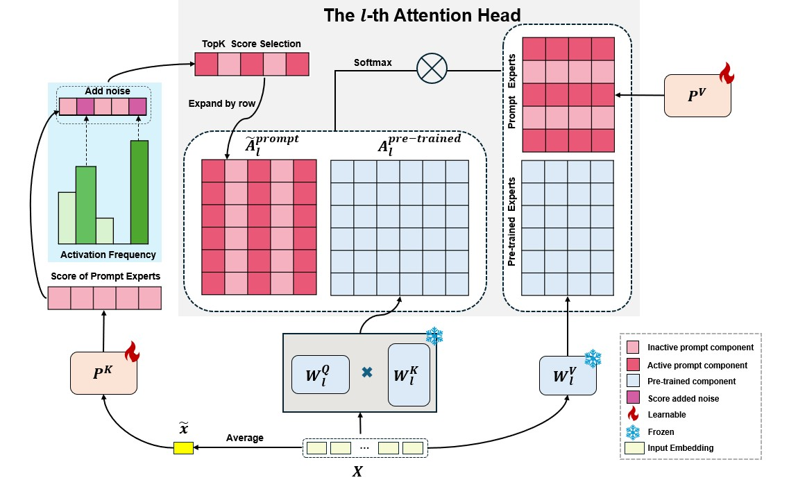

# One-Prompt Strikes Back: Sparse Mixture of Experts for Prompt-based Continual Learning (ICLR 2026)

<div align="center">

[](LICENSE)
[](https://arxiv.org/abs/2509.24483)
[](.)
[](https://iclr.cc/)

**Official PyTorch implementation of the ICLR 2026 paper.**

</div>

## 📖 Abstract

Prompt-based methods have recently gained prominence in Continual Learning (CL) due to their strong performance and memory efficiency. However, existing methods face a dilemma: **Task-specific prompts** incur high computational overhead and linear memory scaling, while **Shared prompts** suffer from knowledge interference and degraded performance.

To reconcile this trade-off, we propose **SMoPE**, a novel framework that integrates the benefits of both strategies. Inspired by the relationship between Prefix Tuning and Mixture of Experts (MoE), SMoPE organizes a shared prompt into multiple "prompt experts" within a sparse MoE architecture.

**Key Contributions:**
*   **🧠 Sparse Activation:** Introduces a prompt-attention score aggregation mechanism to dynamically activate only a subset of relevant experts, effectively mitigating interference.
*   **⚖️ Adaptive Noise:** A mechanism to encourage balanced expert utilization while preserving knowledge from prior tasks.
*   **🔑 Prototype-based Loss:** Leverages prefix keys as implicit memory representations to enhance expert specialization.

Extensive experiments demonstrate that SMoPE consistently outperforms task-specific methods and competes with state-of-the-art approaches while significantly reducing parameter counts and computational costs.



## 📌 Table of Contents
- [Requirements](#-requirements)
- [Data Preparation](#-data-preparation)
- [Project Structure](#-project-structure)
- [Running Experiments](#-running-experiments)
- [Citation](#-citation)

## 🛠️ Requirements

We recommend using **Anaconda** to manage the environment.

1.  **Create environment:**
    ```bash
    conda create -n smope python=3.8
    conda activate smope
    ```

2.  **Install dependencies:**
    ```bash
    # Install PyTorch and core libraries
    pip install torch==2.0.0+cu118 torchvision==0.15.1+cu118 --extra-index-url https://download.pytorch.org/whl/cu118
    
    # Install other requirements
    pip install timm==0.9.12 scikit-learn==1.3.2 numpy pyaml pillow opencv-python pandas openpyxl
    ```
    *Alternatively, you can use the provided file:*
    ```bash
    pip install -r requirements.txt
    ```

## 📂 Data Preparation

Please organize your project directory as follows. You will need to create `data/` and `pretrained/` directories.

### 1. Datasets (`data/`)
Download and extract the following datasets into the `data/` folder:
*   **[CIFAR-100](https://www.cs.toronto.edu/~kriz/cifar-100-python.tar.gz)**
*   **[ImageNet-R](https://people.eecs.berkeley.edu/~hendrycks/imagenet-r.tar)**
*   **[CUB-200](https://data.caltech.edu/records/65de6-vp158/files/CUB_200_2011.tgz)**

### 2. Pre-trained Checkpoints (`pretrained/`)
Download the ViT backbones and place them in `pretrained/`:
*   **[Sup-21K](https://huggingface.co/timm/vit_base_patch16_224.augreg_in21k/blob/main/pytorch_model.bin)** (Rename to `vit_base_patch16_224_in21k.pth`)
*   **[Sup-1K](https://huggingface.co/timm/vit_base_patch16_224.augreg2_in21k_ft_in1k/blob/main/pytorch_model.bin)**
*   **[iBOT-1k](https://lf3-nlp-opensource.bytetos.com/obj/nlp-opensource/archive/2022/ibot/vitb_16/checkpoint_teacher.pth)**
*   **[DINO-1k](https://dl.fbaipublicfiles.com/dino/dino_vitbase16_pretrain/dino_vitbase16_pretrain.pth)**

## 📂 Project Structure

This is the expected folder structure after setting up the data and environment:

```text
SMoPE/
├── configs/                     # Configuration files for different datasets
│   ├── cifar-100_prompt_smope.yaml
│   ├── cub-200_prompt_smope.yaml
│   ├── imnet-r_prompt_smope.yaml
│   └── ...
├── data/                        # Dataset storage
│   ├── cifar-100-python/
│   ├── imagenet-r/
│   └── CUB_200_2011/
├── dataloaders/                 # Data loading logic and splits
│   ├── splits/
│   ├── dataloader.py
│   └── ...
├── experiments/                 # Shell scripts to run training
│   ├── cifar-100.sh
│   ├── cub-200.sh
│   └── imagenet-r_all.sh
├── figures/                     # Images for README
├── learners/                    # Training logic & prompt definitions
│   ├── default.py
│   └── prompt.py
├── models/                      # ViT Backbone
├── pretrained/                  # Pre-trained ViT weights
├── utils/                       # Metrics and helper functions
├── run.py                       # Entry point for single runs
├── trainer.py                   # Main training loop
└── requirements.txt
```

## 🚀 Running Experiments

We evaluate our approach on standard CL benchmarks. The scripts are configured for **1 GPU**. 

The main entry point is the shell scripts located in `experiments/`, which utilize `run.py` and the configurations in `configs/`.

| Dataset | Command |
| :--- | :--- |
| **CIFAR-100** | `sh experiments/cifar-100.sh` |
| **ImageNet-R** | `sh experiments/imagenet-r_all.sh` |
| **CUB-200** | `sh experiments/cub-200.sh` |

> **Note:** Results (logs, checkpoints, and excel sheets) will be automatically saved to a folder named `outputs/`.

## 🤝 Acknowledgements

We thank the authors of the following repositories for their code, which aided our research:
*   [CODA-Prompt](https://github.com/GT-RIPL/CODA-Prompt)
*   [HiDe-Prompt](https://github.com/thu-ml/HiDe-Prompt)
*   [VQ-Prompt](https://github.com/jiaolifengmi/VQ-Prompt)

## 📚 Citation

If you find our work or this codebase helpful, please consider citing:

```bibtex
@article{le2025one,
  title={One-Prompt Strikes Back: Sparse Mixture of Experts for Prompt-based Continual Learning},
  author={Le, Minh and Dao, Bao-Ngoc and Nguyen, Huy and Tran, Quyen and Nguyen, Anh and Ho, Nhat},
  journal={arXiv preprint arXiv:2509.24483},
  year={2025}
}
```